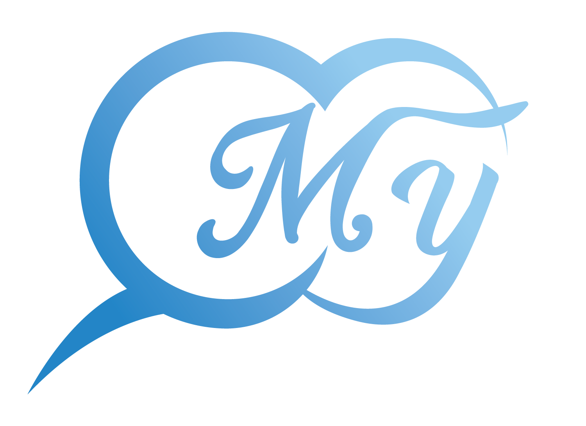

<h1 style="color: #46A8Df" align="center">
My Chat Backend
</h1>
<div align="center">

| <a href="http://nestjs.com/" target="blank"></a>
:-------------------------:|:-------------------------:

</div>

[circleci-image]: https://img.shields.io/circleci/build/github/nestjs/nest/master?token=abc123def456
[circleci-url]: https://circleci.com/gh/nestjs/nest

  <p align="center"><span>My chat</span> Backend được build bằng Nestjs, là một trong số các Nodejs framework phổ biến hiện nay</p>
    <p align="center">
<a href="https://www.npmjs.com/~nestjscore" target="_blank"></a>
<a href="https://www.npmjs.com/~nestjscore" target="_blank"></a>
<a href="https://www.npmjs.com/~nestjscore" target="_blank"></a>
<a href="https://circleci.com/gh/nestjs/nest" target="_blank"></a>
<a href="https://coveralls.io/github/nestjs/nest?branch=master" target="_blank"></a>
<a href="https://discord.gg/G7Qnnhy" target="_blank"></a>
<a href="https://opencollective.com/nest#backer" target="_blank"></a>
<a href="https://opencollective.com/nest#sponsor" target="_blank"></a>
  <a href="https://paypal.me/kamilmysliwiec" target="_blank"></a>
    <a href="https://opencollective.com/nest#sponsor"  target="_blank"></a>
  <a href="https://twitter.com/nestframework" target="_blank"></a>
</p>
  <!--[](https://opencollective.com/nest#backer)
  [](https://opencollective.com/nest#sponsor)-->

## Mô tả

[Nest](https://github.com/nestjs/nest) framework trong My Chat Backend sử dụng TypeScript để xây dựng Nest CLI.

## Yêu cầu
- Node: v14.17.1
- NPM(Node Package Manager): v6.14.13
- Mongodb: v4.4.4

## Cài đặt tất cả thư viện có trong ứng dụng
```bash
$ yarn
```

## Khởi chạy ứng dụng

```bash
# development
$ yarn start

# watch mode
$ yarn dev

# production mode
$ yarn start:prod
```
## Tạo và khởi chạy với docker

```bash
$ docker build -t mychat-backend
$ docker compose up -d
```

